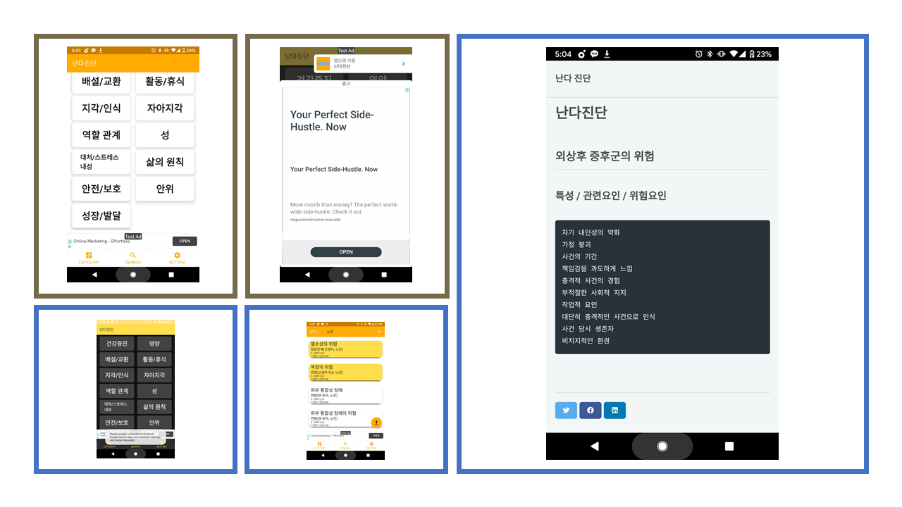
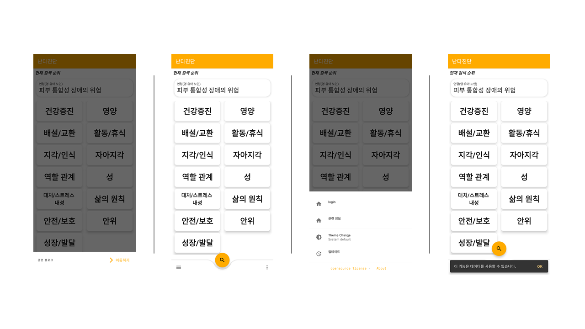
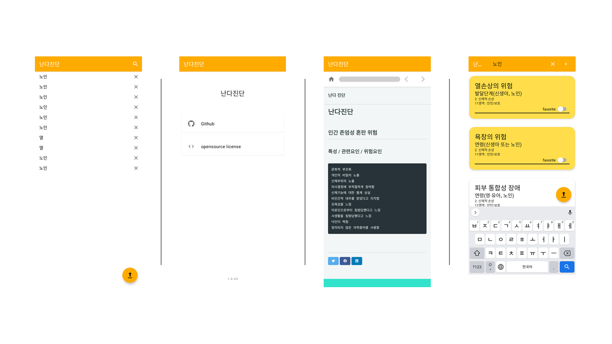
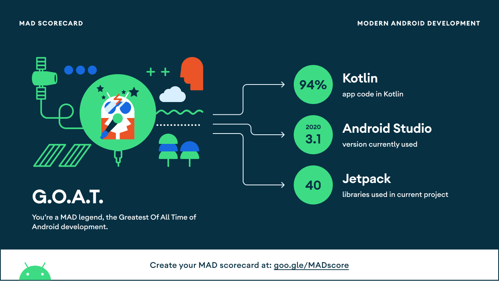
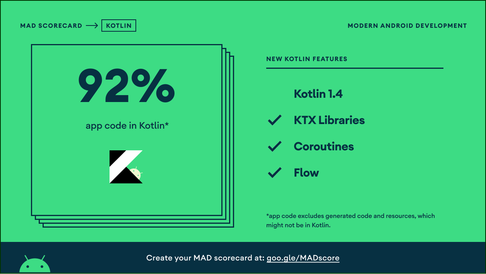

<h1 align="center">nandaDiagnosis</h1>

<p align="center">
  <a href="https://opensource.org/licenses/Apache-2.0"></a>
  <a href="https://android-arsenal.com/api?level=24"></a>
  <a href="https://github.com/keelim/nandaDiagnosis/actions"></a>
</p>

<p align="center">
난다진단(NandaDiagnosis) 의 13가지 항목 건강증진, 영양, 배설/교환, 활동/휴식, 지각/인식, 자아지각, 역할관계, 성, 대처/스트레스 내성, 삶의 원칙, 안전 보호, 안위, 성장/발달의 항목의 데이터를 제공해주는 애플리케이션 입니다.
</p>

```
nandaDiagnosis
├─ app
│  ├─ initialize
│  ├─ service
│  ├─ ui
│  │  ├─ auth
│  │  └─ main
│  │     ├─ category
│  │     ├─ favorite
│  │     ├─ inappweb
│  │     ├─ search
│  │     └─ setting
│  ├─ utils
│  └─ MyApplication.kt
├─ buildSrc
├─ common
├─ compose
│  └─ ui
├─ data
│  ├─ schemas
│  ├─ data
│  │  ├─ db
│  │  ├─ entity
│  │  ├─ network
│  │  ├─ repository
│  │  └─ response
│  └─ di
├─ domain
│  ├─ di
│  └─ domain
├─ gradle
│  └─ android.gradle
├─ build.gradle.kts
├─ settings.gradle.kts
├─ spotless.gradle
└─ spotless.license.kt
```



- - -
##  Version 2





## Tech stack & Open-source libraries
- Minimum SDK level 24
- [Kotlin](https://kotlinlang.org/) based, [introducing Coroutines](https://github.com/Kotlin/kotlinx.coroutines)
- JetPack
  - LiveData - notify domain layer data to views.
  - Lifecycle - dispose of observing data when lifecycle state changes.
  - ViewModel - UI related data holder, lifecycle aware.
  - Room Persistence - construct a database using the abstract layer.
  - RecyclerView + RecyclerView .Selection
- Architecture
  - MVVM Architecture (View - DataBinding - ViewModel - Model)
  - etc ViewBinding
- [Retrofit2 & OkHttp3](https://github.com/square/retrofit) - construct the REST APIs and paging network data.
- [DownloadManager](https://developer.android.com/reference/android/app/DownloadManager?hl=en)  - a system service that handles long-running HTTP downloads.
- [Timber](https://github.com/JakeWharton/timber) - logging.
- [Material-Components](https://github.com/material-components/material-components-android) - Material design components like ripple animation, cardView.
- [Firebase](https://firebase.google.com/) - Crashlytics, Analytics, and in AppMessaging
- [AdMob](https://admob.google.com/intl/ko/home/admob-advantage/)
- [spotless](https://github.com/diffplug/spotless) - for ktlint
- [Git](https://git-scm.com/) - for scm with Git flow strategy
- [Github Actions](https://docs.github.com/en/actions) - for CI/CD (automated playstore(aab))

## MAD Score




## Architecture
MVVM architecture 


## Data


used [nandadaignosis data](https://nanda.org/) data source

# License
```xml
Designed and developed by 2020 keelim (Jaehyun Kim)

Licensed under the Apache License, Version 2.0 (the "License");
you may not use this file except in compliance with the License.
You may obtain a copy of the License at

   http://www.apache.org/licenses/LICENSE-2.0

Unless required by applicable law or agreed to in writing, software
distributed under the License is distributed on an "AS IS" BASIS,
WITHOUT WARRANTIES OR CONDITIONS OF ANY KIND, either express or implied.
See the License for the specific language governing permissions and
limitations under the License.
```
