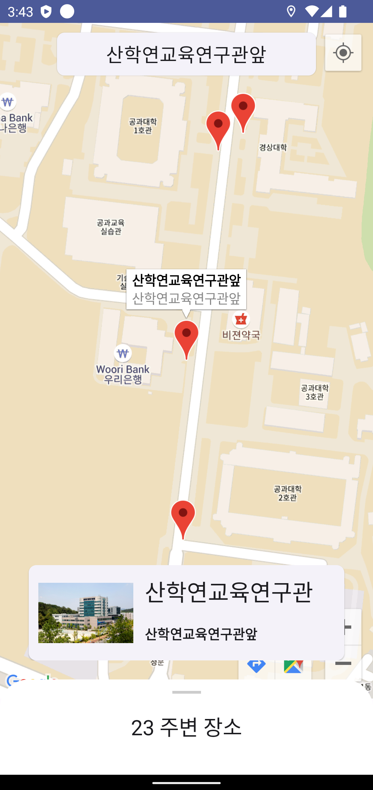
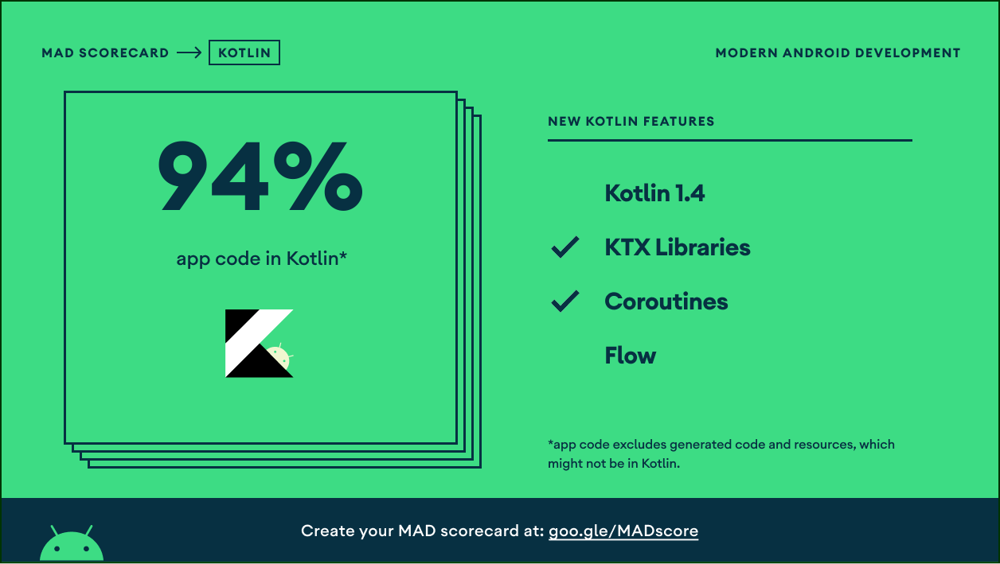

<h1 align="center">project cnubus</h1>

<p align="center">
  <a href="https://opensource.org/licenses/Apache-2.0"></a>
  <a href="https://android-arsenal.com/api?level=24"></a>
</p>

<p align="center">  
- cnubus 는 교내 버스 어플리케이션으로 충남대에서 버스 노선 및 데이터가 있으나 위치 관련된 정보의 부재로 교내 애플리케이션을 통해 위치를 확인할 수 있는 앱을 제작
- 현재 프로젝트 종료로 IOS, Server 서비스 종료로 Firebase 를 이용한 서버리스 서비스 개선 중
</p>

## 챙기면 좋은 코드 룰
- Domain Layer 가 무조건 좋은 것은 아니다. (repository 로 가능하다면 굳이 도입하지 말자) update: 22.06.01


---
## Change logs




이동화면 변경


설정 화면 변경


## Tech stack & Open-source libraries
- Minimum SDK level 24
- [Kotlin](https://kotlinlang.org/) based, [introducing Coroutines](https://github.com/Kotlin/kotlinx.coroutines) 
- JetPack
  - LiveData - notify domain layer data to views.
  - Lifecycle - dispose of observing data when lifecycle state changes.
  - ViewModel - UI related data holder, lifecycle aware.
  - RecyclerView  - (ListView -> RecyclerView 2020.08 )
  - ViewPager2 - advanced ViewPager1
  - navigation 
- Architecture
  - MVVM Architecture (View - DataBinding - ViewModel - Model)
  - etc ViewBinding
- [Retrofit2 & OkHttp3](https://github.com/square/retrofit) - construct the REST APIs and paging network data.
- [Timber](https://github.com/JakeWharton/timber) - logging.1
- [Material-Components](https://github.com/material-components/material-components-android) - Material design components like ripple animation, cardView.
- [Firebase](https://firebase.google.com/) - Crashlytics, Analytics, and in AppMessaging
- [AdMob](https://admob.google.com/intl/ko/home/admob-advantage/)
- [spotless](https://github.com/diffplug/spotless) - for ktlint
- [Git](https://git-scm.com/) - for scm with Git flow strategy
- [Github Actions](https://docs.github.com/en/actions) - for CI/CD (automated playstore(aab))

## MAD Score




## Architecture
MVVM architecture


## UPDATE LOG
- 2022.03.13
  - Preference page update (setting)
  - WorkManager Issue update
## License
```xml
Designed and developed by 2019 keelim (Jaehyun Kim)

Licensed under the Apache License, Version 2.0 (the "License");
you may not use this file except in compliance with the License.
You may obtain a copy of the License at

   http://www.apache.org/licenses/LICENSE-2.0

Unless required by applicable law or agreed to in writing, software
distributed under the License is distributed on an "AS IS" BASIS,
WITHOUT WARRANTIES OR CONDITIONS OF ANY KIND, either express or implied.
See the License for the specific language governing permissions and
limitations under the License.
```
